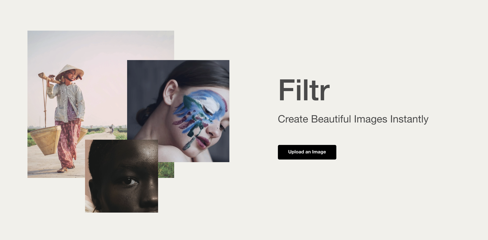
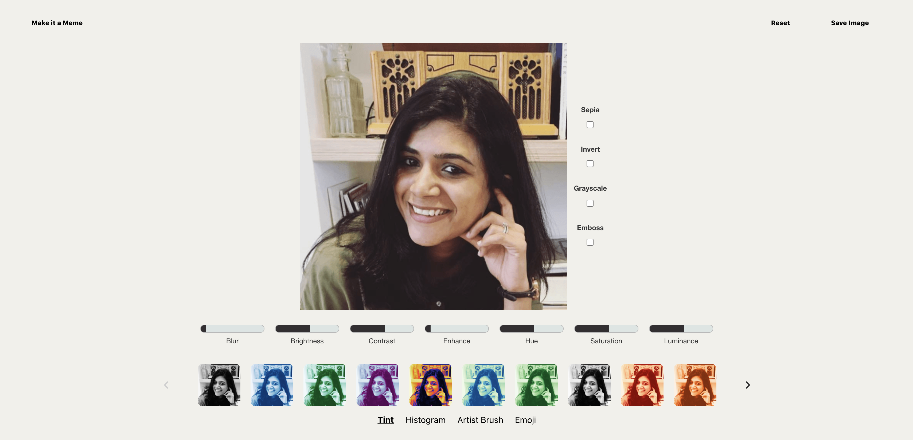
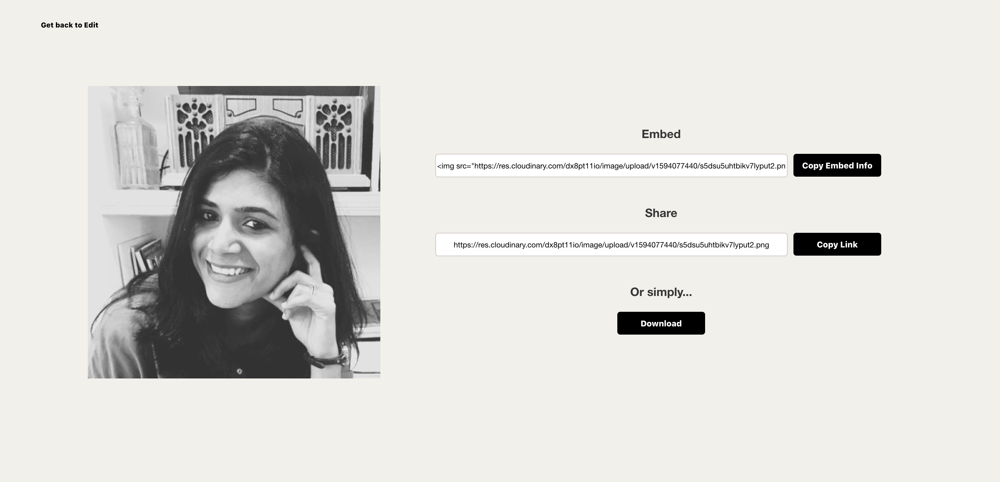
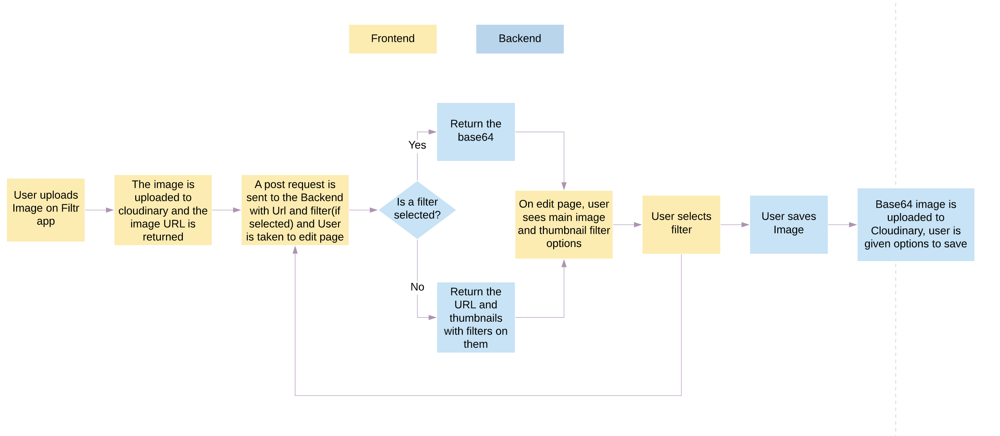
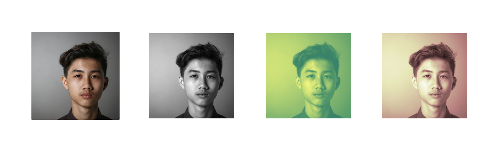
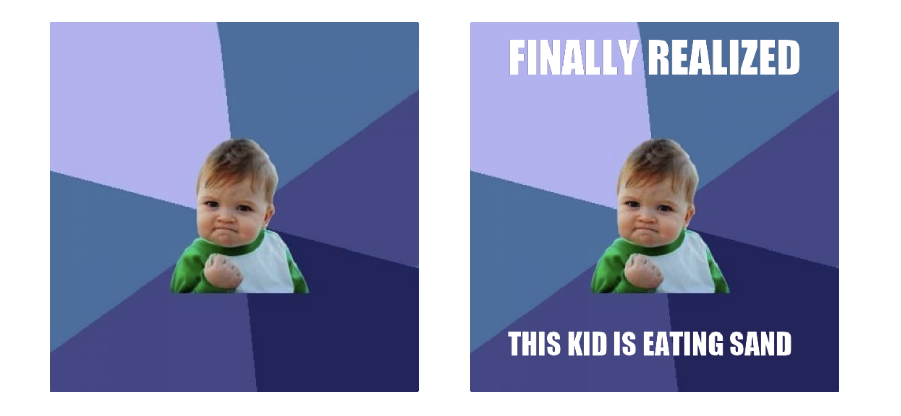
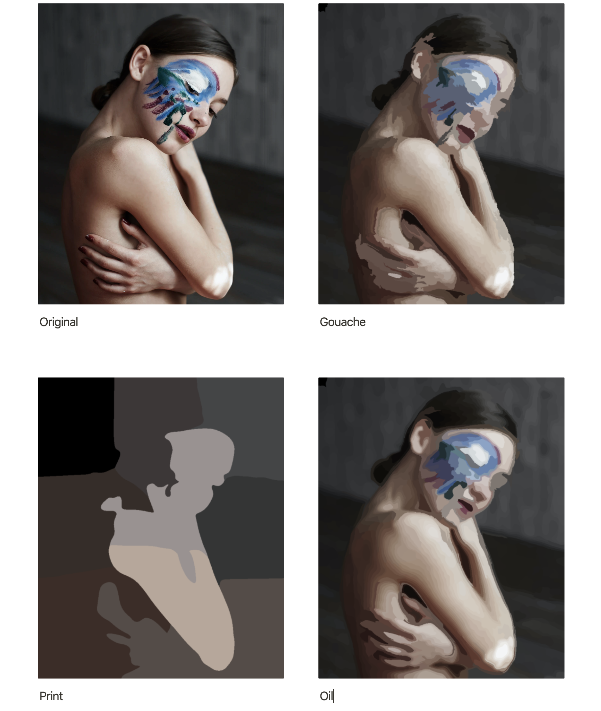
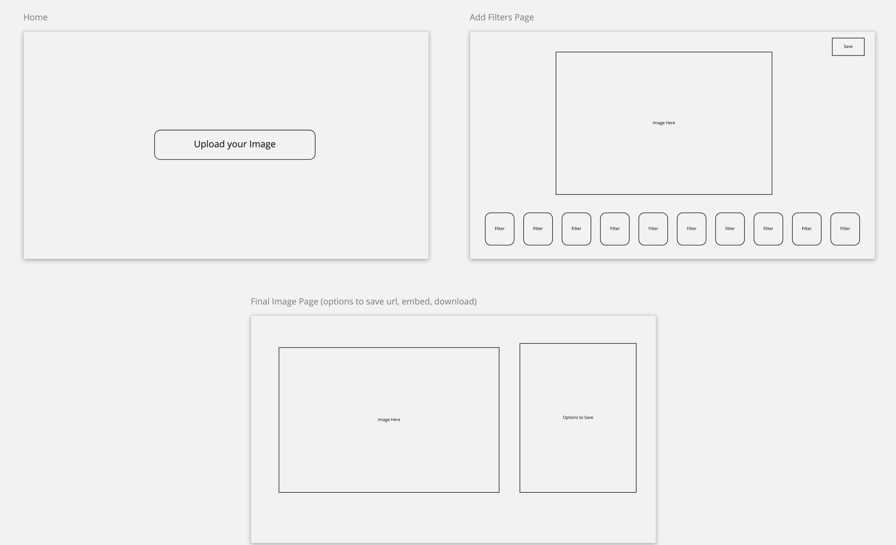

# General Assembly Project 4: Filtr

**Project Members**:
George Jones
Purvi Trivedi

**_Timeframe_**

7 Days

## Goal:

To design a full-stack React app using Python, Django and PostgreSQL.

## Technologies Used

- React Hooks
- Python
- Django
- PostgreSQL
- SASS
- scikit - Image
- Pillow
- base64
- rest_framework
- matplotlib
- Numpy
- Konva
- Axios
- Bulma
- HTTP-proxy-middleware
- Git/GitHub

# Filtr

An image editing app where a user can upload an image and add tint, historgram and artist brush image filters. Users can also make use of CSS filters, add emojis and create memes.

### Deployed version

https://the-filtr-app.herokuapp.com/

## Code Installation

https://github.com/purvitrivedi/image-editing-app

- Clone or download the repo
- <code>pipenv</code> to install Python packages
- <code> python manage.py loaddata images/seeds.json</code>to create initial data for the database
- <code>cd frontend</code> to go to frontend directory
- <code>npm i</code> to install frontend packages
- <code>npm run build</code>
- go back to main directory and run <code>python manage.py runserver</code> to start the app

# Process

## Idea

For my final project, I wanted to push myself and build something different from Project 3's [Hikr](https://hikrr.herokuapp.com/) which was a CRUD app.

When George shared the idea of making an image-editing app, I was immediately interested in pairing up as it was the perfect opportunity to experiment learn something new.

George had already worked out that we could use base64 to quickly send images between frontend and backend. We then created a flowchart to outline the full app journey between the Frontend and the Backend:

## Experiments

Next up, we needed to expirement with image filters using Skicit-image and Pillow. We used Google Collabotary to experiment with filters in a shared document:

Below are two filters we expriemented with, explained step by step:

**Tint Filter using Skicit-Image**:

    from skimage.color import rgb2gray
    from skimage import filters, io, exposure
    from matplotlib import pyplot as plt

    image = 'https://images.unsplash.com/photo-1593720737821-ce72f91b3db8?    ixlib=rb-1.2.1&ixid=eyJhcHBfaWQiOjEyMDd9&auto=format&fit=crop&w=934&q=80'

    
    color_space = 'pink' // select the filter you would like to apply

    // Turns the image into a 3D array of pixels. Takes the RGB  data from the array, make an average and turn it into a grayscale image.
    
    image = rgb2gray(io.imread(image)) 

    // Gaussian filter helps reduce noise and applies slight blurring to keep the image quality high
    
    edge = filters.gaussian(image, sigma=0.6)

    // Plot converts 3D array of pixels into an image a human can see and enjoy.

    fig, axes = plt.subplots(ncols=1, sharex=True, sharey=True, figsize=(12, 12))
    
    axes.imshow(edge, cmap=color_space) //Then apply filter, save figure  with a color space.
    
    axes.axis('off') // Remove the plot axis

    // Save it as a PNG

    output_filename = 'test'
    plt.savefig(f'{output_filename}.png', bbox_inches='tight', pad_inches =     0)
    im.save(f'{output_filename}.png')

Examples:

**Meme Filter using Pillow**:

    from PIL import Image, ImageDraw, ImageFilter, ImageFont
    import requests
    from io import BytesIO
    from skimage import io

    // get an image 
    response = requests.get('https://imgflip.com/s/meme/Success-Kid.jpg')
    im = Image.open(BytesIO(response.content))
    base = im.convert('RGBA')

    // make a blank image for the text, initialized to transparent text color
    txt = Image.new('RGBA', base.size)

    // get a font
    msg_top="FINALLY REALIZED"
    msg_bottom="THIS KID IS EATING SAND"
    fnt_top = ImageFont.truetype('impact.ttf', 60)
    fnt_btm = ImageFont.truetype('impact.ttf', 40)

    // get a drawing context
    d = ImageDraw.Draw(txt)
    w, h = d.textsize(msg_top, font=fnt_top)
    w2, h2 = d.textsize(msg_bottom, font=fnt_btm)

    // draw text
    d.text(((base.size[0]-w)/2,base.size[1]*0.02), msg_top, font=fnt_top, fill=(255,255,255))
    d.text(((base.size[0]-w)/2,base.size[1]*0.82), msg_bottom, font=fnt_btm, fill=(255,255,255))

    // save image
    out = Image.alpha_composite(base, txt)
    out.save('meme.png')

**Artist Brush Filter example**:

## App Layout

We had a simple 3-page layout for when user Uploads Image, plays around with filters and then saves it.

Our **MVP** was to ensure our there was smooth exchange of image data between the frontend and the backend. If we were able to reach that goal quickly, we would add CSS filters.

## Backend

## Frontend

## Challenges

## Wins

## Future Improvements
