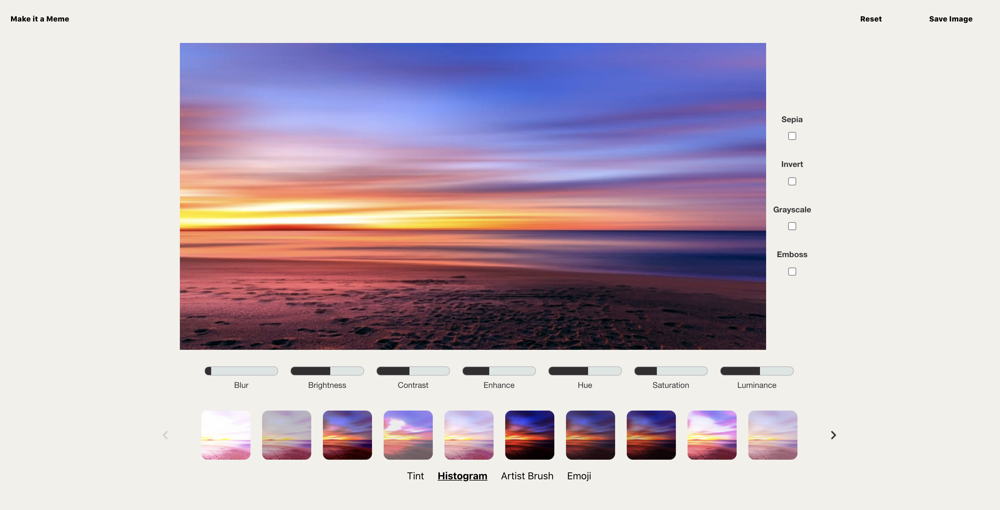

# General Assembly Project 4: Filtr

**Project Members**:

* George Jones: https://github.com/Jompra
* Purvi Trivedi https://github.com/purvitrivedi

**_Timeframe_**

7 Days

## Goal:

Design a full-stack React app using Python, Django and PostgreSQL.

## Technologies Used

- React Hooks
- Python
- Django
- PostgreSQL
- SASS
- scikit - Image
- Pillow
- base64
- rest_framework
- matplotlib
- Numpy
- Konva
- Axios
- Bulma
- HTTP-proxy-middleware
- Git/GitHub

# Filtr

An image editing app where a user can upload an image and add tint, histrogram and artist brush image filters. Users can also make use of CSS filters, add emojis and create memes.

### Deployed version

https://the-filtr-app.herokuapp.com/

## Code Installation

https://github.com/purvitrivedi/image-editing-app

- Clone or download the repo
- <code>pipenv</code> to install Python packages
- <code> python manage.py loaddata images/seeds.json</code>to load filters from the database
- <code>cd frontend</code> to go to the frontend directory
- <code>npm i</code> to install frontend dependencies
- <code>npm run build</code>
- go back to main directory and run <code>python manage.py runserver</code> to start the app

# Process

## Idea
For my final project, I wanted to push myself and build something different from Project 3's [Hikr](https://hikrr.herokuapp.com/), which was essentially a CRUD app.

When George shared the idea of making an image-editing app, I was immediately interested in pairing up as it was the perfect opportunity to experiment & learn something new.

George had already worked out that we could use base64 to quickly send images between the frontend and backend. We then created a flowchart to outline the full app journey:

## Experiments

Next up, we needed to experiment with image filters using Skicit-image and Pillow. We used Google Collabotary to experiment with filters in a shared document:

Below are two filters, explained step by step:

**Tint Filter using Skicit-Image**:

    from skimage.color import rgb2gray
    from skimage import filters, io, exposure
    from matplotlib import pyplot as plt

    image = 'https://images.unsplash.com/photo-1593720737821-ce72f91b3db8?    ixlib=rb-1.2.1&ixid=eyJhcHBfaWQiOjEyMDd9&auto=format&fit=crop&w=934&q=80'

    color_space = 'pink' // select the filter tint you would like to apply

    // Turns the image into a 3D array of pixels. Takes the RGB data from the array, makes an average and turns it into a grayscale image.

    image = rgb2gray(io.imread(image))

    // Gaussian filter helps reduce noise to keep the image quality high

    edge = filters.gaussian(image, sigma=0.6)

    // Plot converts 3D array of pixels into an image a human can see and enjoy.

    fig, axes = plt.subplots(ncols=1, sharex=True, sharey=True, figsize=(12, 12))

    axes.imshow(edge, cmap=color_space) //Then apply filter, save figure  with a color space.

    axes.axis('off') // Remove the plot axis

    // Save it as a PNG

    output_filename = 'test'
    plt.savefig(f'{output_filename}.png', bbox_inches='tight', pad_inches =     0)
    im.save(f'{output_filename}.png')

Examples:

**Meme Filter using Pillow**:

    from PIL import Image, ImageDraw, ImageFilter, ImageFont
    import requests
    from io import BytesIO
    from skimage import io

    // get an image
    response = requests.get('https://imgflip.com/s/meme/Success-Kid.jpg')
    im = Image.open(BytesIO(response.content))
    base = im.convert('RGBA')

    // make a blank image for the text, initialized to transparent text color

    txt = Image.new('RGBA', base.size)

    // get a font
    msg_top="FINALLY REALIZED"
    msg_bottom="THIS KID IS EATING SAND"
    fnt_top = ImageFont.truetype('impact.ttf', 60)
    fnt_btm = ImageFont.truetype('impact.ttf', 40)

    // get a drawing context
    d = ImageDraw.Draw(txt)
    w, h = d.textsize(msg_top, font=fnt_top)
    w2, h2 = d.textsize(msg_bottom, font=fnt_btm)

    // draw text
    d.text(((base.size[0]-w)/2,base.size[1]*0.02), msg_top, font=fnt_top, fill=(255,255,255))
    d.text(((base.size[0]-w)/2,base.size[1]*0.82), msg_bottom, font=fnt_btm, fill=(255,255,255))

    // save image
    out = Image.alpha_composite(base, txt)
    out.save('meme.png')

The **Artist Brush** filter was made using scikit-image image segmentation and smoothing function:

## Wireframes

We decided to go for a simple 3-page layout: when the user uploads an image, plays around with filters and then saves it.

Our **MVP** was to ensure that there is a smooth exchange of image data between the frontend and the backend. If we were able to reach that goal quickly, we would add CSS filters.

### Split of work

George and I used a trello board to divide up tasks between us:

George took ownership of:

* Proof of Concept for: Tint, Histogram, Artish Brush filters 
* Image model routing
* Ensuring text on memes were centered and sized depending on user's input.
* Thumbnail generation
* CSS + Konva Filters.

I took ownership of:

* Proof of Concept for Meme Filter
* Selecting filter options and quality control for Tint, Histogram & Artist Brush filters
* Ensuring users are able to memify an image with a filter on it
* Front-end styling for all pages
* Resetting filters & hover effect.

We pair-coded on "Save Image" feature and anytime we needed to talk through a challenge or fix bugs.

## Backend

On the backend, we have three models: Image, Filter and User. George started working on structure of the Image Model, while I worked on the User Model.

### Image & Filter model, view, urls

The Image Model was the main model. It was use to apply filters and return the base64 image back to the frontend. We send the width and height from the frontend as well, so images are returned with the exact dimensions:
    
    class Image(models.Model):
        url = models.TextField()
        filter_type = models.CharField(
            max_length=10, null=True, validators=[validate_filter])
        filter_options = models.CharField(max_length=200, null=True)
        width = models.IntegerField(null =True)
        height = models.IntegerField(null = True)
    
        def __str__(self):
            return f'{self.url}'

    
The Filter model was created to create the database of filter options from the seeds file.

The views.py and urls.py have 3 main requests: 

* path '': GET to see all Images Uploaded, POST to upload a new image and get a URL/base64 in response
* path'<int:pk>/': GET a single Image
* path'thumbnails/': GET a list of thumbnails

Image POST request:

Thumbnails GET Request:

Thumbnails example for the tint filter:

    def get_sketch_thumbs(img, page):

    thumb_dictionaries = []

    page_index_start = (page - 1) * 10

    sketch_options = Filter.objects.filter(related_filter='sketch')[
        page_index_start:page_index_start + 10]

    for color in sketch_options:
        file_name = sketch(img, color.filter_option, thumbnail=True)
        encoded_image = str(base64.b64encode(
            open(f'{file_name}.png', 'rb').read()))[2:-1]
        thumb_dictionaries.append(
            {'option': color.filter_option, 'image': f'data:image/png;base64,{encoded_image}'})
        os.remove(f'{file_name}.png')
    return thumb_dictionaries

## Frontend

The Frontend was built using React Hooks and for this project, we began working on it at the same time as the backend. This way we could make tweaks to the backend if needed. For example, we wouldn't have realised that we needed to send the width and height of the image to the Backend if we hadn't seen the difference on the page.

We wanted the styling of Filtr to be extremely slick and like the last project, we used a lot of condition rendering to update the "Edit page" instantly. Before and after images of styling the Edit page:

We also used [Konva](https://konvajs.org/) to apply CSS filters and Emoji drop features. The below code is a typical example of how we used Konva and conditional rendering on this page:

      <Stage width={width} height={height} ref={stageRef} id="stage">
        <Layer>
          <Image
            ref={imageRef}
            width={width}
            height={height}
            onMouseEnter={showOriginal} // Onhover to show image without filters
            onMouseLeave={hideOriginal}
            x={0}
            y={0}
            image={im}
            filters={[
              Konva.Filters.Blur,
              Konva.Filters.Brighten,
              Konva.Filters.Contrast,
              Konva.Filters.Enhance,
              Konva.Filters.HSL,

              // * Have to pass the Konva filters a function even if they are not used to surpress warnings in the console.
              
              liveEffect.sepiaActive && appliedEffect ? Filters.Sepia : function   () { },
              liveEffect.embossActive && appliedEffect ?Filters.Emboss  : function () { },
              liveEffect.grayscaleActive && appliedEffect ? Filters. Grayscale : function () { },
              liveEffect.invertActive && appliedEffect ? Filters.Invert : function () { }

            ]}

            // * Conditional rendering to set default filters when the image is reset

            blurRadius={appliedEffect ? liveEffect.defaultEffect.blur}
            brightness={appliedEffect ? liveEffect. brightdefaultEffect.brightness}
            contrast={appliedEffect ? liveEffect.contdefaultEffect. contrast}
            embossStrength={appliedEffect ? liveembossStrength : defaultEffect.embossStrength}
            enhance={appliedEffect ? liveEffect.enhdefaultEffect.enhance}
            hue={appliedEffect ? liveEffect.hue : defaulthue}
            saturation={appliedEffect ? liveEffect. saturadefaultEffect.saturation}
            luminance={appliedEffect ? liveEffect.lumindefaultEffect.luminance}
          />
          {images.map((image, i) => {
            return <URLImage key={i} image={image} />
          })}
          </Layer>
      </Stage>

## Challenges

**Learning about image-editing**: This is a massive topic on its own and one of the tools we used (skicit-image) is typically used by researchers and microscopists. For this reason, there was a lot of trial and error when creating filter settings, documentation reading and stack overflow help that assisted us in getting the right filters.

**Image Size and quality**: This is something we had not considered during the initial plan -- and a good part of day three and four were spent on ensuring we don't compromise on the quality. The Gaussian filter helped reduce noise on the Tint filter, however, we still haven't found the answer for Histogram filter.

## Wins

**TeamWork**: George and I worked extremely well for this project. His experience in Python and my passion for UX helped us make a well-functioning and beautiful product. We organised ourselves using a Trello board with tasks split between "to do, in progress and done" for Front and Back end.

**Artist Brush, Meme Filter & CSS filters**: I'm particularly happy with how well these filters turned out. Artist brush is extremely creative + Meme and CSS Filters give quick and fun results!

**Styling**: I LOVE the styling for this website. Even though the little touches (like the filter animation on the homepage) are time-consuming -- It's satisfying and worth it to present a well-designed app!

## Key Learnings

* Python Fundamentals: As this was my first project using Python, I had the opportunity to solidify my understanding of it. 
* Canvas: An extremely powerful JS tool that I had never used before. I look forward to playing around with it more in the future.
* React Hooks: After making two React apps, React Hooks introduced a new way of working. I enjoyed using it and will continue to use it in future projects.

## Future Improvements

**Histogram Filter**: Our histogram filter needs work, as it's quality is completely dependent on the image uploaded by the user.

**User Login & Profile**: The backend for this is all ready, so we could easily make an Instagram or Pinterest like profile page.
